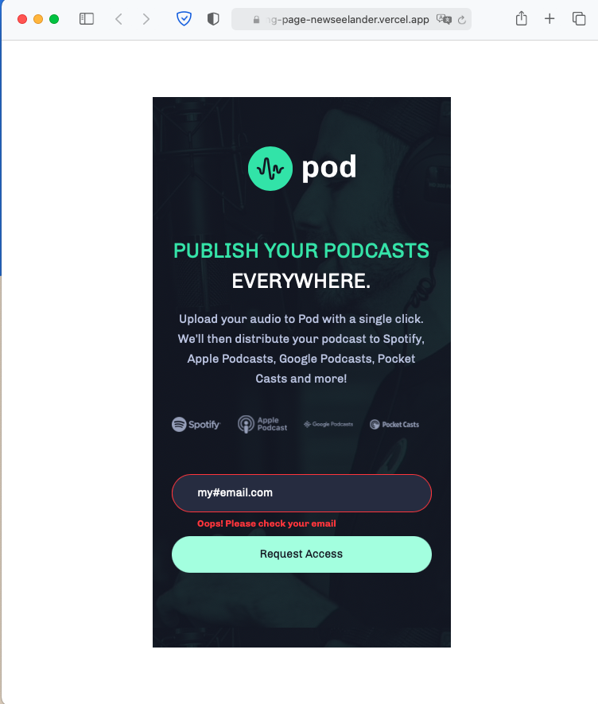
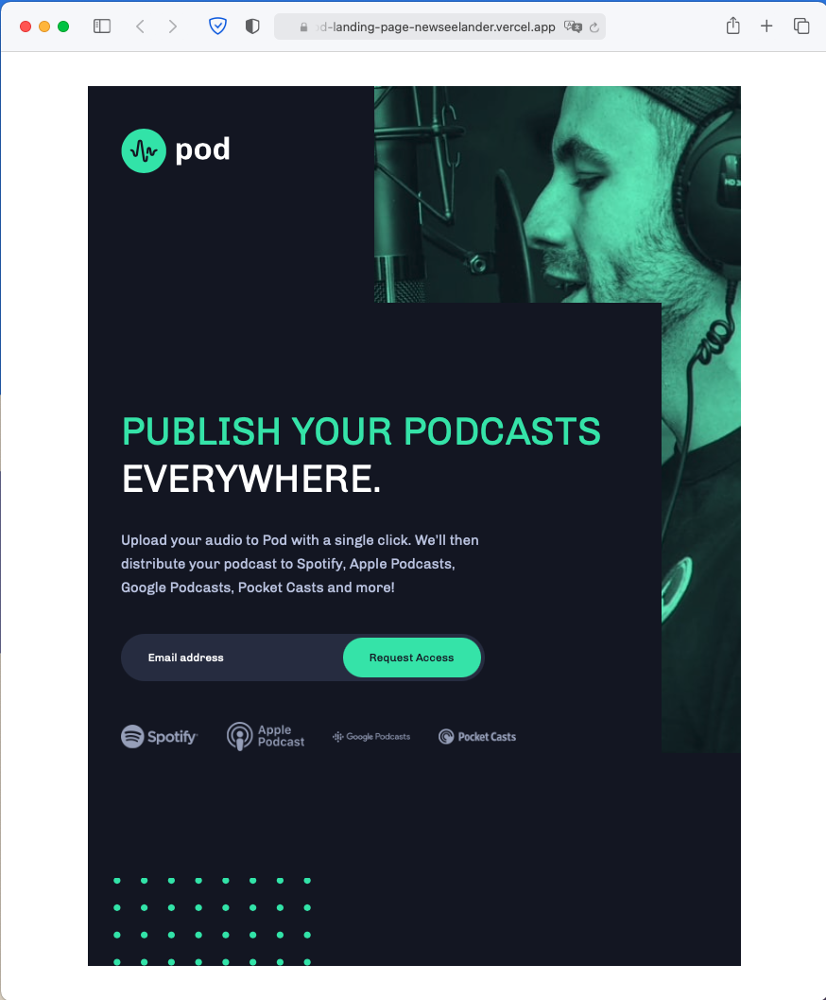

# Pod request access landing page

## Table of contents

- [Overview](#overview)
  - [The project](#the-project)
  - [Screenshot](#screenshot)
  - [Links](#links)
- [My process](#my-process)
  - [Built with](#built-with)
  - [What I learned](#what-i-learned)
  - [Useful resources](#useful-resources)
- [Author](#author)

## Overview

### The project

Users should be able to:

- View the optimal layout depending on their device's screen size
- See hover states for interactive elements
- Receive an error message when the form is submitted if:
  - The `Email address` field is empty should show "Oops! Please add your email"
  - The email is not formatted correctly should show "Oops! Please check your email"

### Screenshot






### Links

- GitHub: [https://github.com/dmitrymitenkoff/pod-landing-page]
- Live Site URL: [https://pod-landing-page-blond.vercel.app]

## My process

### Built with

- Semantic HTML5 markup
- Flexbox
- CSS Grid
- Mobile-first workflow
- JavaScript
- [SASS](https://sass-lang.com) - Sass - CSS extension language

### What I learned

1. It is recommended to use an explicit label instead of an implicit label when designing forms. This is because implicit labels are not handled correctly by assistive technologies, even if the "for" and "id" attributes are used. If the label is not required by the design, CSS allows us to hide the label in an accessible way. Setting display: none or visibility: hiddent is not considered accessible. To visually hide the label, I've opted to use the following code:

```html
<label class="visually-hidden" for="email">Email</label>
<input type="text" name="email" id="email" placeholder="Email address" />
```

```css
.visually-hidden {
  border-width: 0 !important;
  clip: rect(1px, 1px, 1px, 1px) !important;
  height: 1px !important;
  overflow: hidden !important;
  padding: 0 !important;
  position: absolute !important;
  white-space: nowrap !important;
  width: 1px !important;
}
```

2. Using Sass mixin functionality allowed me to apply media breakpoints directly to certain elements rather than write all media queries in one place. Eg, I set two breakpoints (for tablet and desktop) like so:

```scss
@mixin responsive($breakpoint) {
  // TABLET
  @if $breakpoint == tablet {
    @media (min-width: 768px) {
      @content;
    }
  }

  // DESKTOP
  @if $breakpoint == desktop {
    @media (min-width: 1440px) {
      @content;
    }
  }
}
```

I then applied these directly in my scss partials:

```scss
@include responsive(desktop) {
  padding-left: 16.5rem;
}
```

3. In CSS, it's possible to style placeholder text, but different prefixes are applied based on the browser:

```css
::-webkit-input-placeholder {
  /* Chrome/Opera/Safari */
  color: $color-white;
}
::-moz-placeholder {
  /* Firefox 19+ */
  color: $color-white;
}
:-ms-input-placeholder {
  /* IE 10+ */
  color: $color-white;
}
:-moz-placeholder {
  /* Firefox 18- */
  color: $color-white;
}
```

### Useful resources

- [Sass basics](https://sass-lang.com/guide) - This helped me to set up, run and compile my SASS/scss files
- [HTML Inputs and Labels: A Love Story](https://css-tricks.com/html-inputs-and-labels-a-love-story/) - This is an amazing article which helped me finally understand XYZ. I'd recommend it to anyone still learning this concept.

## Author

- Twitter - [@walzinthedesert](https://twitter.com/walzinthedesert)
